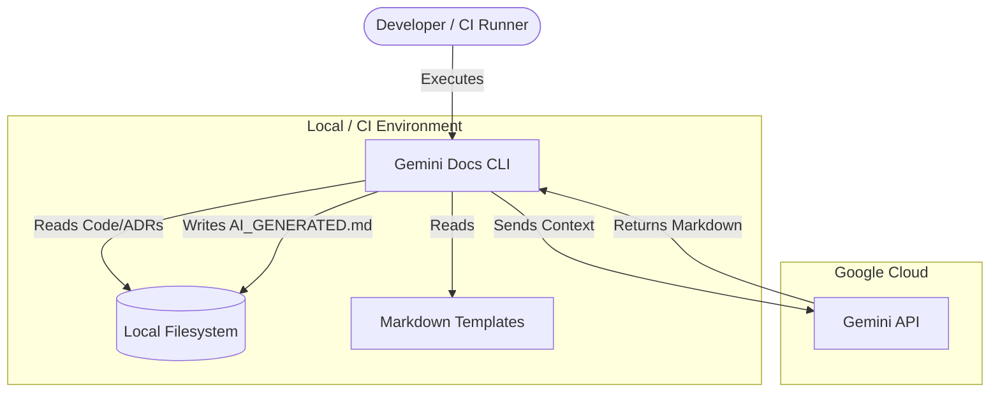

# Gemini Docs

## 🏗️ Architecture (C4 Model)
A CLI tool that orchestrates source code analysis by aggregating local context and interfacing with the Google Gemini API to generate documentation.

## 🔌 Integrations & Data Flow

| Direction | System/Service | Protocol | Purpose | Auth Method |
|--|--|--|--|--|
| **Downstream** | Google Gemini API | HTTPS/gRPC | LLM Content Generation | API Key (Env Var) |
| **Internal** | Local Filesystem | File I/O | Read source/ADR, Write docs | N/A |
| **Internal** | .gitignore | N/A | Filtering files for scanning | N/A |

## ⚙️ Key Configuration & Behavior

| Environment Variable / Flag | Description | Criticality |
|--|--|--|
| `GEMINI_API_KEY` | API Key for Google GenAI authentication. | Critical |
| `-path` | Target directory for source code scanning. | High |
| `-model` | Specific Gemini model (e.g., `gemini-1.5-flash`). | Medium |

## 💰 FinOps Insights
*   **Token Consumption**: The tool sends raw source code and ADRs to the LLM. Large repositories will result in high token usage and potential costs.
*   **Model Selection**: Using `flash` models is recommended to keep costs low compared to `pro` models.

## 🔒 Security Posture
*   **Authentication**: Uses a static API key via environment variables.
*   **Data Privacy**: **High Risk**. The tool transmits raw source code and architectural decisions to a third-party (Google). Ensure no secrets are present in the source code before execution.
*   **Hardcoded Exclusions**: Automatically ignores sensitive directories like `.git`, `node_modules`, and `vendor` to prevent accidental data leakage or processing overhead.
*   **Encryption**: Relies on the standard Google GenAI SDK for transport-level encryption (TLS) during API calls.