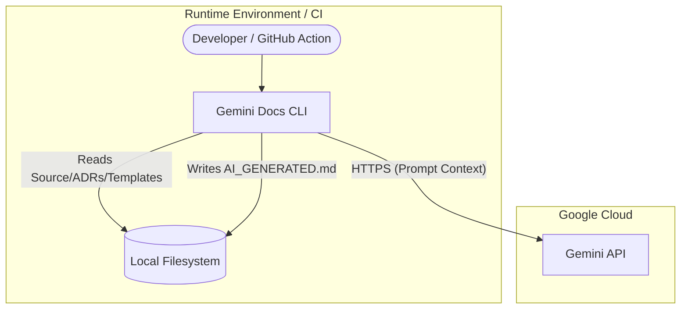

# Gemini Docs

## 🏗️ Architecture (C4 Model)
The application is a CLI-based documentation generator that aggregates local source code and design records to process them via an external Large Language Model (LLM).

## 🔌 Integrations & Data Flow
The application acts as an orchestrator, concatenating local file contents into a single prompt for the Gemini AI.

| Direction | System/Service | Protocol | Purpose | Auth Method |
|--|--|--|--|--|
| **Downstream** | Google Gemini API | HTTPS | Generates documentation text | API Key |
| **Internal** | Local Filesystem | File I/O | Reads templates, ADRs, and source | N/A |
| **Upstream** | GitHub Actions | N/A | Triggers documentation update | N/A |

## ⚙️ Key Configuration & Behavior
Behavior is controlled via CLI flags and a mandatory environment variable.

| Configuration | Description | Criticality |
|--|--|--|
| `GEMINI_API_KEY` | Environment variable for API authentication | High |
| `-path` | Target directory for scanning (default: `./`) | Medium |
| `-model` | Target Gemini model (e.g., `gemini-1.5-pro`) | Medium |

## 🔒 Security Posture
- **Authentication**: Uses `GEMINI_API_KEY` environment variable. The client initialization suggests standard API key usage.
- **Authorization**: N/A.
- **Data Privacy**: **High Risk.** The tool recursively scans the codebase and sends raw text to an external 3rd party (Google). 
- **Missing Mechanisms**: 
    - **Secret Scanning**: There is no pre-processing to redact secrets (keys, passwords) from the code before sending it to the LLM.
    - **Path Sanitization**: The application ignores `.git` and `node_modules`, but does not strictly limit data ingestion to non-sensitive files beyond basic extension whitelisting.

## 💰 FinOps Observations
- **Token Costs**: The application sends the *entire* codebase (filtered by whitelist) + ADRs in a single prompt. For large repositories, this will result in extremely high token consumption per run.
- **Model Selection**: Using `gemini-1.5-pro` (as seen in the README) is significantly more expensive than `flash` models. Recommended to use flash for iterative documentation tasks.